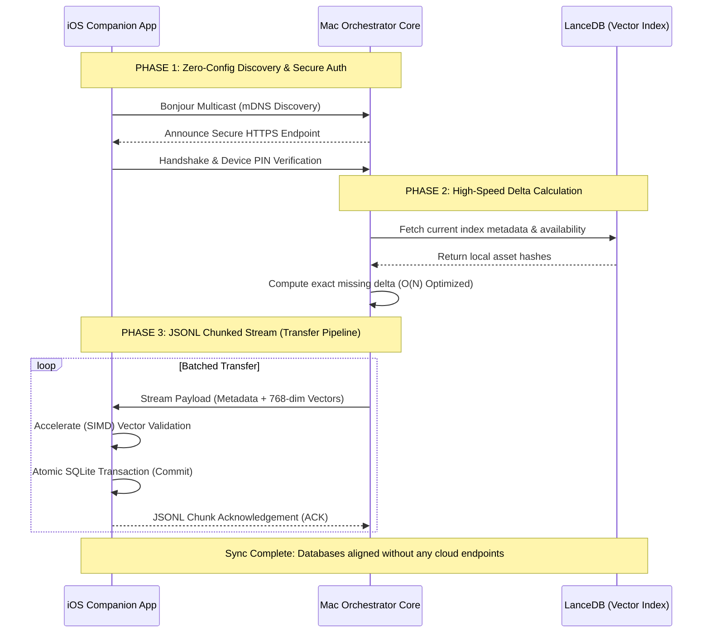
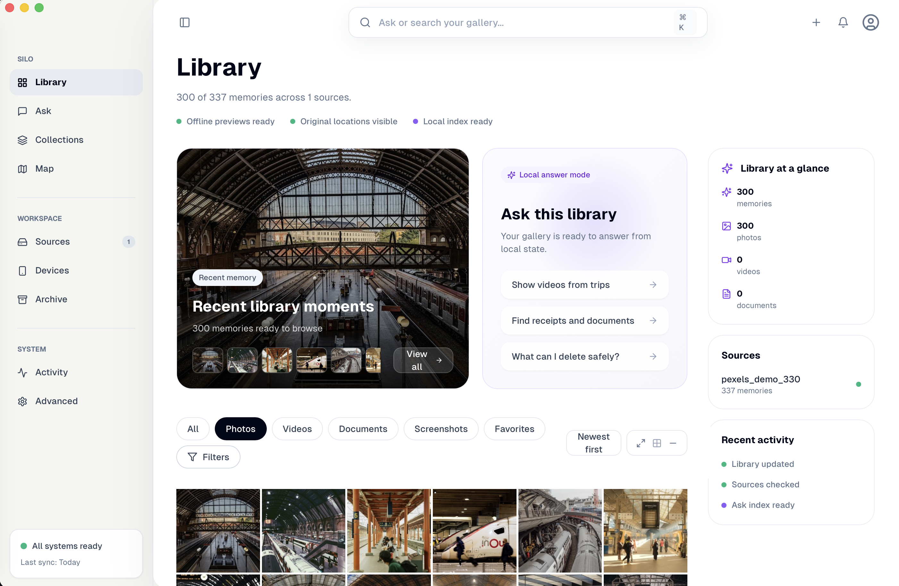
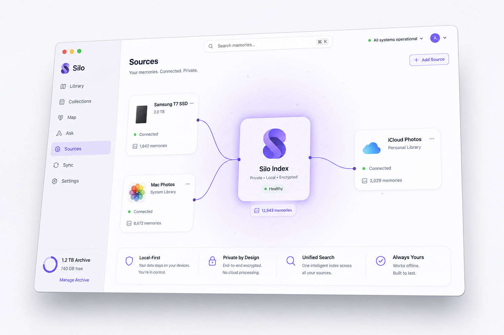
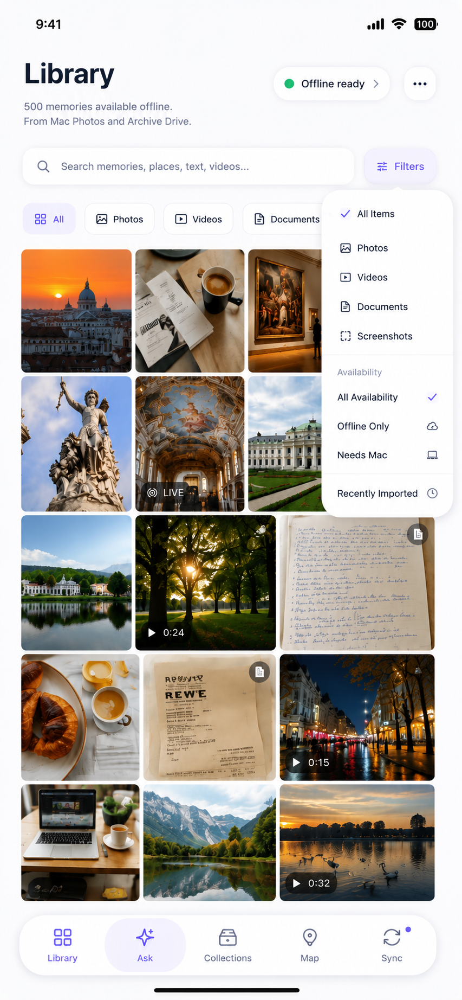
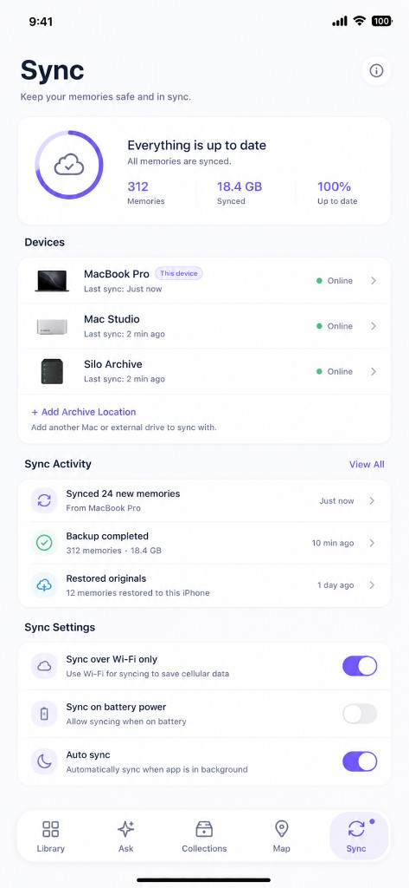

# SILO — Local-First Personal Media Ecosystem

**Your photo drive, alive on your iPhone.**

SILO is a professional-grade media management system designed to keep your original data under your control. It combines a high-speed Rust-based desktop orchestrator with a native iOS companion app, featuring hardware-accelerated semantic search and a custom-built, private-by-design AI pipeline.

---

## 🎯 The Vision: Not a dead backup.
iCloud is alive, but SSDs are cheap. SILO connects the missing piece. Current solutions force a painful choice: pay rising monthly cloud subscriptions and surrender your data, or use external hard drives that turn your memories into an unsearchable dead archive. 

**Not another cloud. Not a dead backup.** SILO brings the intelligent, seamless experience of modern cloud galleries directly to your local, offline storage. Stop letting your photo drive become a graveyard.

---

## 🚀 Prototype Benchmark (MacBook Air M3)

We stress-test our backend with complex, real-world libraries on standard consumer hardware, proving that enterprise-grade AI doesn't require a server rack.

**Test Corpus:** 725 local media files (including 50 heavy video files).
**Total Time:** **~5 minutes** on a fanless MacBook Air M3.

This time covers the **complete multimodal AI pipeline** executing 100% locally:
*   Multi-format metadata extraction & indexing into LanceDB.
*   Image & video proxy generation (Metal hardware-accelerated).
*   Multimodal semantic embeddings (PyTorch → CoreML port).
*   Object detection and bounding box mapping.
*   Intelligent OCR for all visual assets.
*   **VAD (Voice Activity Detection), Audio Cleanup, and Transcription (Subtitles).** 

***Performance Note:** Approximately **70% of the total runtime** is actively dedicated to generating local, high-fidelity subtitles and audio processing for the video files. The remaining hundreds of photos are fully processed and indexed in a fraction of that time.*

*No cloud endpoints. No rate limits. 100% private execution.*

---

## 🛠 Core AI Capabilities

### Visual Intelligence
*   **Semantic Understanding:** Multimodal indexing allows for hyper-specific natural language queries. 
    *(e.g., "a single tree", "beautiful evening in the mountains", or "blue coffee mug on a desk").*
*   **Object Recognition:** Automated detection and classification of objects, scenes, and people.
*   **Intelligent OCR:** Full-text extraction from images and screenshots for searchable visual notes.

### Audio & Video Processing
*   **Speech Transcription:** Automated voice-to-text conversion for videos, making speech searchable.
*   **Audio Source Separation:** Advanced voice isolation and noise reduction to clean up video audio tracks.
*   **Video Proxies:** Real-time generation of lightweight previews for instant scrubbing of large 4K archives.

---

## 📊 Compute Time Distribution
To demonstrate the extreme optimization of our visual pipeline on consumer hardware (M3 Air), here is the breakdown of where the ~5 minutes of compute time is actually spent across the 725 files (including 50 videos).

| Pipeline Stage | Workload | Time Spent | Compute Distribution |
| :--- | :--- | :--- | :--- |
| **Visual Core** | Photos + Video Proxies, Embeddings, Object Detection, OCR | **~1m 30s** | `███░░░░░░░░` (~30%) |
| **Audio AI** | Video VAD, Noise Isolation, Whisper Transcription | **~3m 30s** | `████████░░░` (~70%) |

*This proves that the core intelligence (semantic search, OCR, object detection) is incredibly lightweight and fast. The heavy lifting is intelligently isolated to video audio processing, preventing the UI from blocking during massive imports.*

---

## 🛠 ML Engineering: PyTorch to CoreML
A core technical achievement of SILO is the **complete porting and optimization of 7+ production-grade AI models** from PyTorch to CoreML. This ensures all intelligence runs locally on the Apple Neural Engine (ANE) with maximum power efficiency and zero data leakage.

*   **Optimized Models:** Ported complex architectures for Visual-Language understanding, Object Detection, OCR, Audio Source Separation, and Transcription.
*   **Performance:** Achieved near-native inference speeds by utilizing 16-bit quantization and ANE-optimized layers.

---

## 🔄 Custom P2P Sync Protocol
Designed a high-reliability synchronization engine that ensures your Mac and iPhone databases remain perfectly aligned without relying on intermediate cloud servers.

**Storage Relief (>97% Reduction):** A lightweight proxy layer allows you to browse massive SSD archives directly on your iPhone, reducing storage footprint by over 97% while keeping originals safe in the vault. Zero cloud upload required.

---

## 🏗 Engineering Highlights

### 1. Scalable Hybrid Search
Implemented a dual-node search architecture. The desktop uses disk-optimized vector indexing for archives spanning decades, while the mobile companion app leverages native hardware acceleration for sub-second search across 400k+ assets with a minimal memory footprint.

### 2. Reliable P2P Sync Protocol
Designed a custom synchronization engine utilizing JSONL chunking and idempotent batch processing. This ensures data integrity and high throughput even over unstable Wi-Fi connections, supporting the transfer of massive media libraries without data loss.

### 3. Isolated Processing Architecture
To maximize system stability, heavy media decoding and AI inference are isolated into dedicated sub-processes. This ensures the primary user interface remains fluid and responsive even during peak indexing loads.

---

## 🛠 Tech Stack

*   **Backend:** Rust (Orchestration, High-speed I/O).
*   **Desktop UI:** React (Fluid, gallery-first experience).
*   **Mobile:** Swift Native (Hardware-level integration).
*   **Intelligence:** On-device Neural Engines and GPU acceleration for all AI tasks.
*   **Storage:** Scalable vector indexing for multi-million asset archives.

---

## 🛤 The Engineering Journey: Pivots & Pragmatism

Building a complex, local-first AI product requires ruthless pragmatism. SILO underwent significant architectural pivots to reach its current state:

### Pivot 1: Escaping the Flutter Bottleneck
The initial prototype was built using **Flutter and Dart**. However, the sheer volume of data processing (handling 400k+ media assets) quickly exposed Dart's performance limits. 
*   *Attempt 1:* Integrated `flutter_rust_bridge` to offload heavy compute to Rust.
*   *The Realization:* While compute improved, Flutter's UI rendering for massive media grids and its immature ecosystem for integrating on-device AI models remained severe bottlenecks.
*   *The Pivot:* Executed a full architectural rewrite to **React + Tauri 2**. This unlocked fluid, native-grade UI rendering for thousands of thumbnails and provided a much richer ecosystem for building desktop-class software, with Rust driving the entire backend unhindered.

### Pivot 2: Native AI over Generic Frameworks
Running semantic search models (PyTorch/ONNX) on mobile devices initially drained battery and introduced unacceptable latency.
*   *The Pivot:* Re-engineered the machine learning pipeline to compile and run models natively via Apple's **CoreML** and **Accelerate (vDSP)** framework. 
*   *The Result:* Search latency dropped from seconds to <150ms, processing directly on the Neural Engine (ANE) with near-zero thermal impact.

---

## 🖼 Showcase

**SILO AI Search on iPhone:** Local-first Semantic Search executing purely on Apple Neural Engine (ANE).

---

### 💻 Desktop Orchestration (Tauri/React)

**High-Volume Indexing:** Handling infinite scale archives with isolated processing.

**Source Management:** Direct mapping of cold-storage SSDs to the proxy layer.

---

### 📱 Intelligent Companion (Swift Native)

**Fluid Gallery Experience:** Seamlessly browse hundreds of thousands of proxies with advanced local filtering.

**Zero-Cloud Sync:** Real-time JSONL delta streaming over local Bonjour.

---

*Note: This repository contains documentation and architectural overviews for portfolio purposes. The core source code is private and proprietary.*